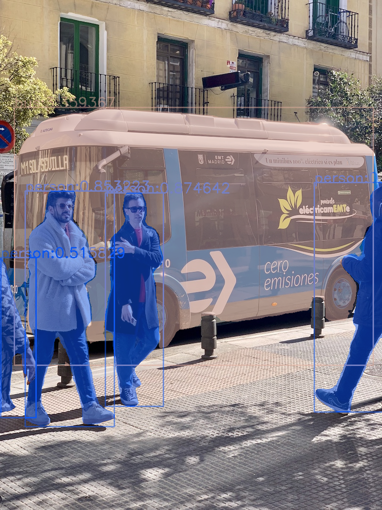

# yolov5-seg-opencv-dnn-cpp
使用opencv-dnn部署yolov5实例分割模型
基于6.2版本的yolov5:https://github.com/ultralytics/yolov5

**OpenCV>=4.5.0**

```
python export.py --weights yolov5s-seg.pt --img [640,640] --include onnx --dnn
```
#### 2022.11.10 更新
+ 之前旧版本计算结果mask图像的时候，是整个特征图和特征掩码进行的矩乘法，然后切割出bounding-box区域二值化，这个速度在我看来还是太慢，特别是检测结果框多并且目标都不大的情况下，整张特征图进行乘法的开销大，而有用的就区域就一小块，类似下面的领带那样，大部分特征图区域是无效的，所以本次修改变成对特征图进行裁剪，然后进行后续的矩阵乘法，特别是小目标比较多的情况下提升比较大，而两者结果基本上基本一致，仅仅由于部分四舍五入的原因差了一个像素。如果你的小目标对于一个像素的偏移无法接受的话，那么就使用旧版本方法。
+ 这两种方法具体差距情况可以看[differ-from-tow-method.bmp](res/bus_diff.bmp)。

 
#### 2022.10.10 更新：  
+ 0.opencv不支持动态推理，请不要加--dymanic导出onnx。
+ 1.关于换行符，windows下面需要设置为CRLF，上传到github会自动切换成LF，windows下面切换一下即可<br>
+ 2.有些小伙伴用版本为1.12.x的pytorch的时候，需要将
https://github.com/ultralytics/yolov5/blob/c98128fe71a8676037a0605ab389c7473c743d07/export.py#L155
这里的标志位改成```do_constant_folding=False, ```,否者opencv用dnn读取不了onnx文件
+ **4.关于mask**
  > 原始的mask采用的是整张图片mask，即使你的box很小，整张图就一小块区域，也会是整个mask。修改之后变成了box内mask，mask跟着box的大小走（原始代码中的crop操作），提升速度的同时，内存开销也会减小。具体变换结果可以看[tie-mask.bmp](res/boxMask.bmp)

以下为yolov5-seg.onnx运行结果：

